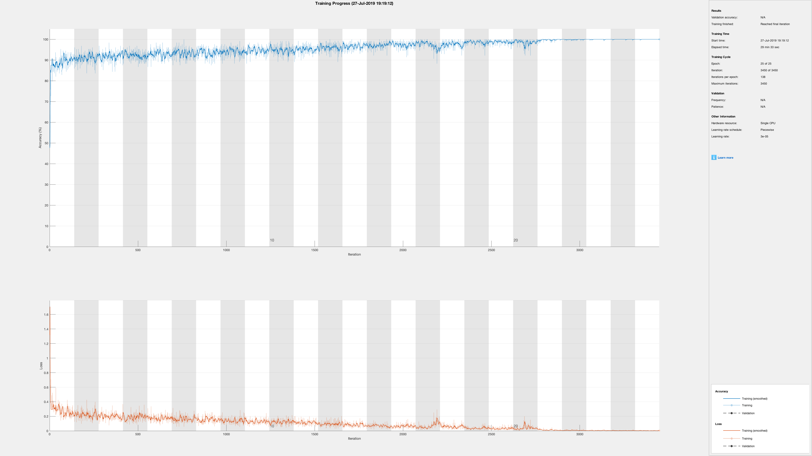
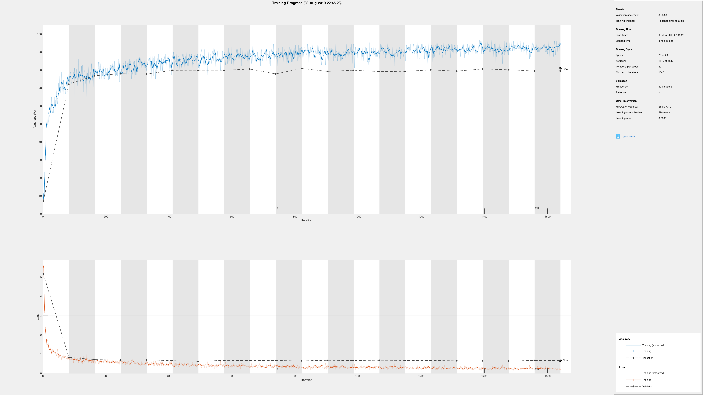

# Soundscape Information Retrieval

This is a summer research project I did in 2019 with Prof. Tae Hong Park at NYU Steinhardt Music Technology. The first part of this project was to identify aircraft noise among urban soundscapes ([GetNoisy](https://www.getnoisy.io/)), and the second part was to classify acoustic events into six general classes ([*Towards Soundscape Information Retrieval*, ICMC 2014](https://speech.di.uoa.gr/ICMC-SMC-2014/images/VOL_2/1218.pdf)).

We built a convolutional neural network in MATLAB, with MFCC features of short audio clips as inputs, and classification tags as outputs. The training result of aircraft noise identification was nearly perfect, with a validation accuracy above 95% (Fig. 1).

<caption>
 Figure 1. Aircraft Noise Classification Training Progress.
</caption>

The training result of 6 acoustic events classification was less accurate, with approximately 90% training accuracy and 75% validation accuracy (Fig. 2).

<caption>
 Figure 2. Acoustic Events Classification Training Progress.
</caption>

The acoustic event detection was implemented in real-time with trained neural networks. The device reacted to the audio input with a latency less than 0.1s, then drew on the real-time audio spectrogram of the span of its predicted acoustic event.
